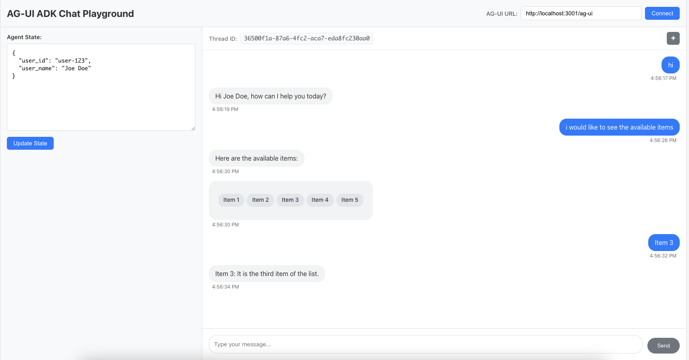

# AG-UI ADK React Chat Playground

A simple AG-UI ADK React Chat playground to explore, understand, test and debug AG-UI technology. It provides a controlled testing environment for experimenting with different configurations, troubleshooting issues, and validating agent behaviors.

> ⚠️ **Developed with AI assistance as a learning and experimentation tool, focusing on rapid prototyping and technology exploration rather than production-ready code standards.**

> 🌟 **If this project helps you with AG-UI testing and development, please consider giving it a star!** ⭐  

## 🌐 Playground

🔗 **https://rrazvd.github.io/ag-ui-adk-react-chat/**



## ✨ Features

### 🌐 Flexible Configuration
- **Custom Server URLs**: Connect to any AG-UI compatible server
- **Environment Variables**: Configurable settings for different environments
- **Initial State Setup**: Define custom initial agent states
- **Query String Parameters**: Configure playground state via URL parameters for easy sharing and bookmarking
- **Extensible API Layer**: Preserves all original ADK SDK routes while extending with AG-UI endpoint (`/ag-ui`)

### 🤖 Interactive AI Agent
- **Real-time Chat**: Seamless conversation interface with streaming responses
- **Tool Integration**: Custom front-end tools for enhanced interaction (e.g., interactive lists)
- **Context Awareness**: Maintains conversation context across messages

### 🔧 Developer Tools
- **Debug Console**: Browser console integration for debugging agent interactions
- **State Management**: Real-time agent state visualization and editing
- **Thread Management**: Create and manage multiple conversation threads
- **Event Monitoring**: Track agent events (messages, tool calls, state changes)

## 🚀 Get started: development

### 1. Install dependencies
```bash
nvm install && npm install && npm run install:agent
```

### 2. Activate environment
```bash
source agent/.venv/bin/activate
```

### 3. Set up your Google API key
```bash
export GOOGLE_API_KEY="your-google-api-key-here"
```

### 4. Run the project

#### Option 1: Run agent and playground interface
```bash
npm run dev
```

| Resource | URL | Description |
|---------|-----|-------------|
| 🚀 **AG-UI ADK Server** | http://localhost:8000/ag-ui | Main AG-UI endpoint |
| 📚 **API Documentation** | http://localhost:8000/docs | All original ADK + AG-UI routes |
| 🎮 **React Chat Playground** | http://localhost:3005 | Interactive testing interface |

#### Option 2: Run playground interface only
```bash
VITE_AG_UI_URL="http://localhost:8000/ag-ui" VITE_INITIAL_STATE='{"user_id":"user-123","user_name":"John Doe"}' npm run dev:ui
```

Change `VITE_AG_UI_URL` to your AG-UI server and `VITE_INITIAL_STATE` to correspondent required state.

## �🔧 Environment Variables

| Variable | Description | Default | Required |
|----------|-------------|---------|----------|
| `GOOGLE_API_KEY` | Google API key for AI agent | - | ✅ |
| `VITE_AG_UI_URL` | AG-UI server URL | `http://localhost:8000/ag-ui` | ❌ |
| `VITE_INITIAL_STATE` | Initial chat state (JSON) | `'{"user_id":"user-123","user_name":"John Doe"}'`| ❌ |
| `VITE_BASE_PATH` | Base path for deployment (e.g., GitHub Pages) | `/` | ❌ |

## � Query String Parameters

The playground supports URL query parameters for easy configuration sharing and bookmarking:

### Available Parameters

| Parameter | Description | Example |
|-----------|-------------|---------|
| `target` | AG-UI server URL | `?target=http://localhost:8000/ag-ui` |
| `state` | Initial agent state (JSON) | `?state={"user_id":"user-123","user_name":"John Doe"}` |
| `thread` | Specific thread ID to load | `?thread=abc123def456` |

### 📝 Notes
- Query parameters are automatically synchronized with the playground state
- Parameters are preserved when present in the initial URL
- JSON values in `state` parameter should be URL-encoded
- All parameters are optional and will fallback to environment defaults

## ⚠️ Disclaimer

This playground is built using specific versions of AG-UI ADK components. For compatibility and optimal performance:

- Ensure your AG-UI server version matches the ADK version used in this project
- Some features may not work correctly with different AG-UI server versions

## 🤝 Contributing

We welcome contributions! Please see our [Contributing Guide](CONTRIBUTING.md) for details on how to:

- 🐛 Report issues and bugs
- 🔧 Submit pull requests
- 🎯 Find areas to contribute
- 📋 Set up your development environment

**Thank you for helping make this testing tool better for the community!** 🙏